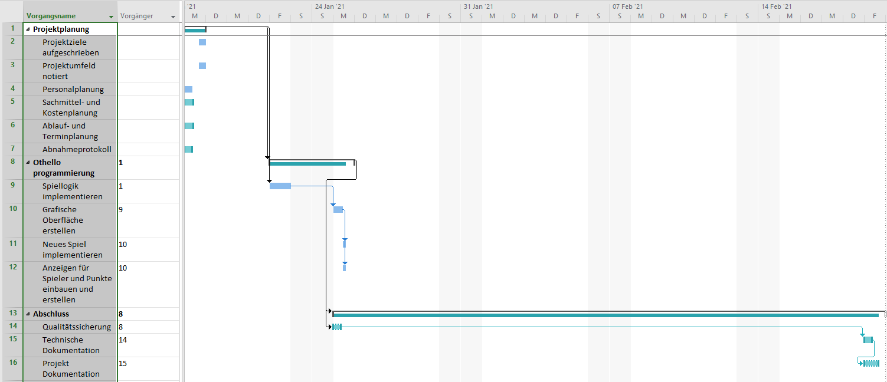

# Othello

## Inhaltsverzeichnis

1. [Ausganssituation](#ausgangssituation)
1. [Ressourcen- und Ablaufplanung](#ressourcen--und-ablaufplanung)
1. [Durchführung- und Auftragsbearbeitung](#durchführung--und-auftragsbearbeitung)
1. [Projektergebnisse](#projektergebnisse)
1. [Verzeichnis der Arbeits-/Hilfsmittel](#verzeichnis-der-arbeits-/hilfsmittel)
1. [Anhang](#anhang)

## Ausgangssituation

### Projektumfeld

Das Projektteam besteht aus Thomas Stark und Martin Plieske.  
Thomas Stark und Martin Plieske sind beide Auszubildende Fachinformatiker in der Fachrichtung Anwendungsentwicklung.

### Projektziele

Die Firma TSE GmbH beauftragt ihre Softwareabteilung, ein Spiel für die Pausengestaltung der Mitarbeiter zu entwickeln. Das Spiel "Othello" soll programmatisch umgesetzt werden. Anforderungen sind unter anderem eine grafische Oberfläche. Auf dieser soll angezeigt werden, welcher Spieler an der Reihe ist. Damit das Programm nicht immer neu gestartet werden muss, soll es einen Schaltfläche für das starten neuer Spiele geben.

### Prozessschnittstellen (Ansprechpartner, Ein- Ausstieg, Arbeitsumgebung)

Als Ansprechpartner ist Der Berufsschullehrer Gregor Kompa vorgesehen.

Wegen der SARS-CoV-2-Pandemie befinden setzt jeder der Azubis das Spiel zuhause im Mobile Office um.

## Ressourcen- und Ablaufplanung

### Personalplanung

| Person | Zuständigkeit |
|:-------|:------------|
| Thomas Stark | Das Projektteam ist zuständig für die Durchführung des Projekts |
| Martin Plieske | Fachlehrer unterstützen in Ausnahmesituationen das Projektteam und sind für Aufsicht über die Teams zuständig. |

### Sachmittelplanung

| Produkt | Anzahl |
|:--|:--|
| Bildschirm | 5 |
| Displayport Kabel | 5 |
| Kaltgerätekabel | 7 |
| Computer | 2 |
| Tastatur | 2 |
| Computermaus | 2 |
| Tisch | 2 |
| Stuhl | 2 |
| Headset | 2 |
| CAT 6 Kabel | 2 |
| Visual Studio Code | 2 |
| IntelliJ IDEA Community Edition | 1 |
| JavaFx Scene Builder | 1 |
| Discord | 2 |
| Github | 1 |
| Git | 1 |
| JetBrains Raider | 1 |
| Adobe Photoshop | 1 |
| Windows | 1 |
| Manjaro Linux | 1 |

### Ablaufplanung

### Terminplanung

| Person ||

### Kostenplanung

### Qualitätsplanung

## Durchführung- und Auftragsbearbeitung

* Prozessschritte, Vorgehensweise, Knackpunkte, Qualitätssicherung
* Abweichungen, Anpassungen, Entscheidungen

## Projektergebnisse

* Soll-Ist-Vergleich, Abnahme, Bewertung (Fazit, Ausblick)

## Verzeichnis der Arbeits-/Hilfsmittel

* Literatur, Internet-Quellen, Software, Tools

## Anhang

* Abnahmeprotokoll
* Quelltext, UML, STGs
* evtl. Spielanleitung
* Kostenrechnung
